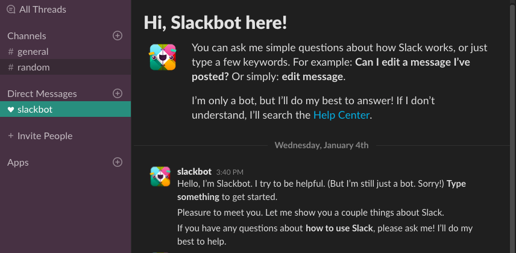

# Slack Themes

How to turn slack app into the Dark :)

---

## How to
- Go to
```
/Applications/Slack.app/Contents/Resources/app.asar.unpacked/src/static
```
- Edit `ssb-interop.js to add the following lines:


```
document.addEventListener('DOMContentLoaded', function() {
 $.ajax({
   url: 'https://raw.githubusercontent.com/mdellerie/slack-themes/master/black.css',
   success: function(css) {
     $("<style></style>").appendTo('head').html(css);
   }
 });
});
```

---

## Preview



+++
Don't hesitate to fork the CSS to customize the darkness :)

---
Thanks for watching :)